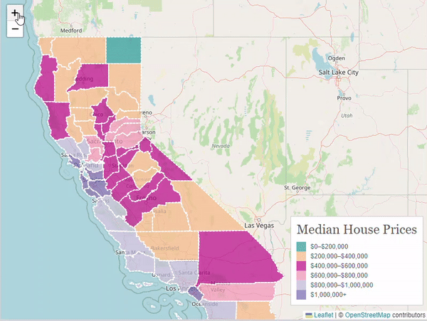
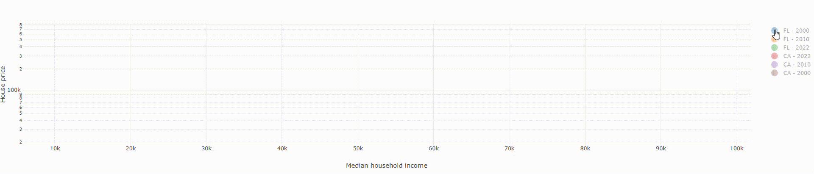

# California Housing Market Analysis
## Data Analysis and Visualization 
Our project had following visualization :
### Choropleth Map 
A choropleth map of median house prices in California for 2023 is a type of thematic map where different counties are colored in relation to the median house prices in each area. The colors on the map represent different price ranges, allowing viewers to easily identify which counties have higher or lower median home prices at a glance.A 2023 choropleth map of California's median house prices would provide insights into how economic factors like demand, location, and availability of homes are influencing the real estate market across the state.

### County Comparison Graph with Economic Indicators
California's housing market is one of the most dynamic and expensive in the United States, influenced by a combination of high demand, limited supply, and economic factors such as income levels, job availability, and interest rates. Major cities like San Francisco, Los Angeles, and San Diego see some of the highest median home prices, driven by economic opportunities and lifestyle amenities that attract buyers. By comparing economic indicators like GDP, interest rates, and unemployment across counties, this analysis highlights regional trends and provides insights into the economic pressures shaping California’s housing market.

### Map of Median Housing Prices Over Time
The map visualizes changes in California's median housing prices over time, illustrating trends across the state’s diverse counties. Housing prices in California have seen significant growth, with urban and coastal areas often experiencing the steepest increases. This map offers a chronological view, showing how local economies, migration patterns, and shifts in demand have impacted different regions. By tracking these fluctuations, we can observe patterns related to economic cycles, policy changes, and social trends that have shaped housing affordability and accessibility across California.

### California Housing Prices vs. Florida Housing Prices
Income-to-Price Ratio: Comparing the median home price to the median household income can give a rough indication of affordability.
In this case, the ratio is approximately 9.3 for California & 6.8 for Florida.
A lower ratio is generally more favorable for homebuyers, suggesting that housing costs are a smaller proportion of their income.

